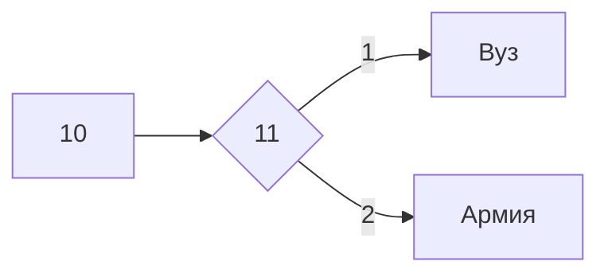

Алексей Семенов 122 Б)

Файлы в репозитории:

10 не 10.py Переводит из 10 в не 10

UntitledO.ipynb Google Collab

bdtest.txt Тест базы данных

logic.xlsx Таблица логики из сайта

logic2task.xlsx 2 Таблица логики из сайта

sql.txt Команды sql

table.py Таблица умножения в питоне

Демо ЕГЭ ответы.py ЕГЭ 1 и 2 задание

Морзе Английский.py Азбука Морзе на английском

Морзянка.xlsx Азбука Морзе

Нейронка.png Скриншот из нейросимулятора

Перевод из десятичной сс умножение в восьмеричной сс.xlsx 

табл истиности.xlsx Таблица истинности

bool.py логическое выражение

Викторина про шахматы Викторина из 5 вопросов о шахматах

Снимок.png ещё одно логическое выражение (14)

$$ S = \frac{abc}{4R} $$

$$ E_{1}^2=\sqrt{\frac{Fa^{x-1}}{(x-1)x}}+a_{1}^{\frac{1}{3}}+B_{2}^{\frac{2}{3}} $$

$$ S = \Pi R^{2} $$

